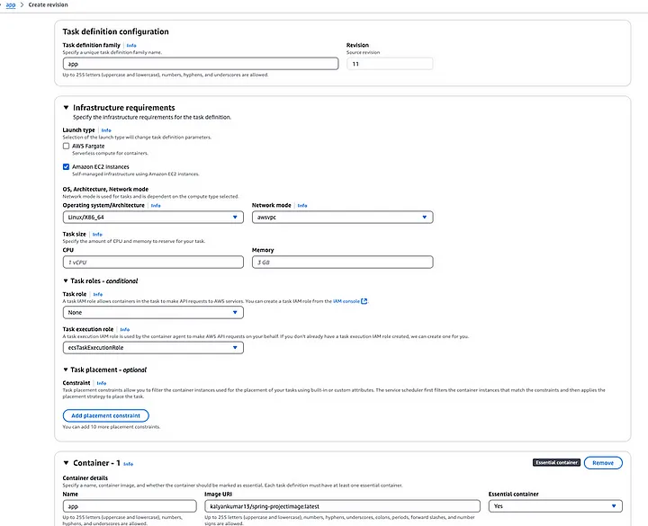
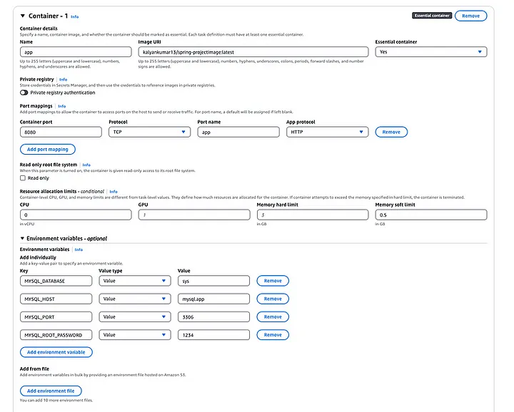

# Leveraging ECS Service Discovery for Reliable and Scalable Microservices

AWS ECS (Elastic Container Service) Service Discovery simplifies the communication between services in a distributed application. It automatically registers ECS tasks to DNS and enables applications to discover each other without requiring a hardcoded IP or manual service registration. Let’s dive into an overview of ECS Service Discovery, its features, advantages, and disadvantages.

## What is AWS ECS Service Discovery?
AWS ECS Service Discovery integrates tightly with Amazon Route 53, leveraging its DNS capabilities to provide service discovery for ECS tasks. When tasks in a service are launched, their DNS records are created and updated in a Route 53 namespace, enabling other services to discover and communicate with them dynamically.

### How It Works
1. **Namespace Configuration:** Create a private or public namespace in Route 53 (e.g., myapp.local).
2. **Service Registration:** ECS services register their tasks with DNS records in the specified namespace.
3. **DNS Resolution:** Applications resolve the service name (e.g., service1.myapp) to obtain the task’s IP address for communication.

Service Discovery supports multiple modes:

**DNS-based Discovery:** Resolves names into IPs using A or SRV records.

**Cloud Map Discovery:** Enables advanced discovery options with attribute.

I am setting up a Spring Boot application that requires a MySQL container, so I am creating separate MySQL and application services, with communication between them enabled through ECS Service Discovery. Don’t worry, I have a Docker image for my application in [dockerhub](https://hub.docker.com/repository/docker/kalyankumar13/spring-projectimage/general).

### Architecture Overview

##### Service app:

This is application container, runs in private subnets.
Dosen’t use service discovery, as it exposed to load balancer.

##### Service mysql

Uses AWS Service Discovery for internal communication.
Mysql container, runs in private subnets.

##### Load Balancer:

Internet-facing ALB in public subnets.
Routes traffic to Service app in private subnets.

### Step-by-Step Implementation

##### Step 1: ECS Cluster Setup
I believe you’ve got your ECS cluster up and running, along with the necessary IAM policies to allow the tasks to execute properly. For service discovery, ensure that the ecsTaskExecutionRole has the following policy to enable service discovery operations. I have created custom-inline policy and attached to it.

```
{
    "Version": "2012-10-17",
    "Statement": [
        {
            "Effect": "Allow",
            "Action": [
                "servicediscovery:DiscoverInstances",
                "servicediscovery:GetService",
                "servicediscovery:GetInstancesHealthStatus"
            ],
            "Resource": "*"
        },
        {
            "Effect": "Allow",
            "Action": [
                "ecs:DescribeServices"
            ],
            "Resource": "*"
        }
    ]
}
```

This policy allows ECS tasks to interact with AWS Cloud Map (service discovery) for service discovery and health status monitoring, as well as to describe ECS services.

##### Step 2: Create Task Definitions for app and mysql

A **Task Definition** in Amazon ECS (Elastic Container Service) is a blueprint that describes how Docker containers should run in an ECS cluster. It defines the configuration for your containers, including the resources they need, networking settings, environment variables, and more.

Below images show the task definition of mysql.


Below images, shows the task definition for app




I am using EC2 Auto Scaling Groups (ASG) and the awsvpc network type for my ECS setup to ensure scalable and efficient container networking.

The awsvpc network mode in Amazon ECS is a networking mode where each ECS task (container) is assigned its own **elastic network interface (ENI)** within your VPC. This mode is typically used when you want the ECS task to have full control over its networking, such as direct communication with other AWS resources (like RDS or DynamoDB) and private IP addressing.

When ECS service discovery is enabled in a cluster with awsvpc, ECS automatically registers the task's **private IP address** in Route 53 under the specified namespace. This allows other services within the VPC to resolve and connect to that task using its DNS name.

##### Step 3: Create Service
- Select the **Task Definition** you want to use for the service.
- **Service Name:** Enter a name for the service.
- **Number of Tasks:** Specify the desired number of tasks to run.
- **Cluster VPC:** Select the VPC and subnet configuration for your tasks (for awsvpc network mode, select the VPC and subnets where your tasks will run).
- Check Service Discovery tab in console.
- Select an existing **namespace** or create a new one in Route 53.
- Choose the appropriate **service name** for the service discovery.


I have created **app** namespace and **mysql** as service discoverable name.

- Under Network tab, select appropriate vpc and subnets, where EC2 instances are running. Create security group and allow port 3306 of mysql.

Similar steps apply for creating the application service, which doesn’t require service discovery since it will be exposed to the load balancer. For the application service, make sure to allow traffic on port **8080** in the security group, as the container is running on this port.

In AWS Cloud Map, you will be able to see the app namespace, and under it, the **mysql service** will be listed. AWS Cloud Map integrates with Route 53, allowing you to register DNS records automatically for the services in your Cloud Map namespace.

**Cloud Map App Namespace**→ mysql service is listed under it.

**Route 53 Hosted Zone** → The DNS records for your services (e.g., mysql.app.) are created and managed automatically.


##### Step 4: Associating Load Balancer with ECS Service
Before configuring the load balancer, it’s essential to create target groups where the load balancer will route traffic. Target groups define the specific instances or services that will handle incoming requests. These target groups are then associated with your load balancer to ensure proper traffic distribution and health monitoring.

In this setup, we have a network interface for our ECS task, which means we need to select the appropriate IP type for our target group.


Navigate to **Elastic Network Interfaces** and find the network interface attached to your ECS task to retrieve the **Private IP Address**. In the target group configuration, select IP type and specify the Private IP Address and the container port (8080). This ensures the load balancer routes traffic to the correct IP and port for your application.


Add the ENI’s IP into target IP


**Create Load Balancer:** In the AWS Console, create an internet-facing Application Load Balancer (ALB) in the appropriate VPC and public subnets.

**Create Security Group:** Create a security group that allows inbound traffic on ports 80 (HTTP) and 443 (HTTPS) from any source (0.0.0.0/0).

**Associate SG and Target Group:** Attach the created security group to the ALB and associate it with the appropriate target group during the setup.


After creating the Load Balancer, you will receive its DNS name in the AWS Console.
Use this DNS name in your browser to access and view your application.


### Advantages of AWS ECS Service Discovery
1. **Simplified Service-to-Service Communication:**
Service Discovery eliminates the need for hardcoded IP addresses. Applications can locate services using DNS names, even when services scale or change dynamically.

2. **Automatic DNS Registration:**
Tasks are automatically registered and deregistered with DNS as they are started or stopped. This ensures that only healthy and active tasks are discoverable.

3. **Tight Integration with AWS Ecosystem:**
ECS Service Discovery integrates seamlessly with:
- Route 53 DNS for name resolution.
- CloudWatch for monitoring DNS queries and logs.
- IAM for secure access management.
4. **Support for Microservices Architecture:**
In a microservices setup, Service Discovery facilitates inter-service communication by enabling DNS-based resolution of services. It’s particularly useful when services are deployed across different ECS tasks or services.

5. **Enhanced Load Balancing and Failover:**
Using SRV records or A records, Service Discovery can provide multiple task IPs, enabling applications to load balance requests across healthy tasks. If a task fails, it’s automatically removed from DNS, ensuring failover is handled seamlessly.

6. **Reduced Complexity with Built-In Features:**
Health Check Integration: Tasks are only discoverable if they pass health checks.
Dynamic Scaling: Works well with ECS’s auto-scaling capabilities, dynamically updating DNS records as tasks are added or removed.

### Disadvantages of AWS ECS Service Discovery
1. **Dependency on Route 53:**
Service Discovery’s reliance on Route 53 means you’re tied to AWS for DNS management. This can be a limitation if you’re using a multi-cloud or hybrid setup.

2. **Limited Features:** Compared to Service Mesh
While Service Discovery handles DNS-based resolution well, it lacks the advanced features of a service mesh (e.g., traffic shaping, observability, and zero-trust security). For complex microservices architectures, tools like Istio or AWS App Mesh might be more suitable.

3. **Potential Latency in DNS Updates:**
DNS-based Service Discovery may introduce latency when tasks are added or removed due to TTL (time-to-live) values in DNS records. Applications might cache stale IPs temporarily.

4. **Lack of Native Support for Non-AWS Services:**
ECS Service Discovery is designed primarily for AWS-managed services. Integrating external or on-premises services requires custom solutions or additional setup.

5. **Overhead in Large-Scale Systems:**
In large-scale systems with frequent task scaling, the constant registration and deregistration of tasks in DNS can lead to operational overhead and increased Route 53 query costs.

6. **Complexity in Multi-Region Deployments:**
In a multi-region setup, managing service discovery across regions can become complex. Route 53’s latency-based or geo-routing policies can mitigate this but require careful planning.

7. **Limited ENI:**
When we use ECS ASG EC2 clusters, number of ENI allocated is based on instance type. For example: c6.large can able to have maximum of 3 ENI. We can not able to have more than 3 tasks in the instance.
But, If we have ECS Fargate clusters, we can have upto 350 ENI per region in an account.

## Conclusion

AWS ECS Service Discovery is a robust tool for simplifying service-to-service communication in containerized environments. Its tight integration with ECS and Route 53 makes it an excellent choice for many AWS-centric workloads. However, for complex, large-scale, or multi-cloud architectures, it’s worth considering other alternatives or augmenting Service Discovery with additional tools. By carefully weighing its pros and cons, you can determine whether AWS ECS Service Discovery fits your use case effectively.
